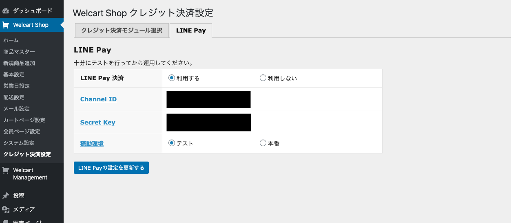

# Welcart用 LINE Pay 決済プラグイン(非公式)
「usc-e-shop-line」はWelcart専用のLINE Pay決済プラグインです。  
Welcartの開発元であるコルネ株式会社様や、LINE Payを提供するLINE株式会社とは無関係の、非公式プラグインとなっております。

このプラグインを使うには以下の準備が必要です。
* WordPressのインストール  
詳しくは、WordPressのマニュアルをご覧ください。(https://ja.wordpress.org/)  
* Welcartのインストール  
詳しくは、Welcartのマニュアルをご覧ください。(https://www.welcart.com/about/)  
* LINE Payの契約  
このプラグインを使うにはLINE Payの加盟店申請が必要です。  
加盟店申請後、LINE Payの連動キーを取得してください。  
詳しくは、LINE Payのマニュアルをご覧ください。(https://pay.line.me/file/guidebook/technicallinking/LINE_Pay_Integration_Guide_for_Merchant-ver1.0.6-ja(1).pdf)

# はじめに
こちらはWelcart専用の拡張プラグインです。  
Welcartに「LINE Pay」を決済方法に追加することができます。

2020年現在、Welcartの公式等で、WelcartへLINE Pay決済を追加するプラグインが販売されておりますが、そちらとは無関係に開発されたプラグインです。

元々、社内学習の一環でこのプラグインを開発しており最終的にGPLでの公開をすることとなりましたが、
その前後で、他社で同様のプラグインが開発され、公式でも販売がされたという経緯となっております。

# 動作環境
* WordPress 5.3.2
* Welcart 1.9.26
* PHP7.0～7.3

※以上で動作確認しております。  
※他のバージョンでも動く可能性はあります。

# 導入方法
Welcartがインストール済みのWordPress環境に、本プラグインのファイルを一式  
/wp-content/plugins/usc-e-shop-line/usc-e-shop-line.php  
/wp-content/plugins/usc-e-shop-line/classes/*  
/wp-content/plugins/usc-e-shop-line/images/*  
等となるように設置してください。

次に、WordPressの管理画面を開きプラグインの管理画面を開きますと「LINE Pay for Welcart」というプラグインが表示されていますので、有効化してください。  
これにより、Welcartから「LINE Pay」が見えるようになります。
 
次に、Welcartの管理画面のクレジット決済設定を表示します。  
※メニューバーのWelcart Shop>クレジット決済設定  
ここで、「LINE Pay」が表示されているはずですので、使用する決済モジュールとして登録します。

登録ができますと、クレジット決済設定タブに「LINE Pay」タブが表示されますので、
そちらのタブの画面に入り、以下のように
LINE Payから取得した連動キーを設定して保存してください。  
また、稼働環境は「テスト」に設定し、決済ができることを確認した後に「本番」に設定してください。

これで、WelcartでLINE Payが使えるようになりました。

但し、Welcartでは実際に、決済に使用するには決済方法の登録が別途必要です。  
これはメニューバーのWelcart Shop>基本設定から行うことができます。  
詳しくは、Welcartのマニュアルをご覧ください。

# サポート
あるがままでの提供となるため特にサポートはありません。自己責任でご利用ください。  
但し、当社はソフトウェア一筋で20年以上の「老舗ソフトウェア／クラウドベンダー」ですので、導入サポートやカスタマイズなどを有償で承ることは可能です。  
「[バーチャル・ラボ](https://www.webimpact.co.jp/virtuallab)」等のサービスもありますので、ご希望があれば、当社までお問い合わせください。

# ライセンス
[GPLv2](https://www.gnu.org/licenses/gpl-2.0.html) or later

ライセンスはGPLv2、または、それ以降となっております。  
営利・非営利問わず、ご利用いただけます。  
その他、改変や再頒布も許可されておりますが、詳しくはGPLについてご確認ください。

# 免責
本プラグインを使用し、または、第三者に提供することによって生じるいかなる損害に対しても、当社は一切責任を負いません。  
これは、本プラグインに不具合等が存在していた場合を含みます。  
また、本プラグインに不具合等が見つかった場合でも、当社では修正の義務は負いません。  
プログラムはソースコードを含め、すべて提供しているため、利用者側で十分に確認を行って利用してください。  

# 商標等
* Welcartは、コルネ株式会社の商標です。
* LINE、LINE Payおよびそれらの名称及びロゴは、LINE株式会社またはその関連会社の商標です。
* その他、記載されている固有名詞などは各社の商標や登録商標です。

# 著作権
WEBIMPACT(https://www.webimpact.co.jp/)

Copyright © WEBIMPACT Co., Ltd.
